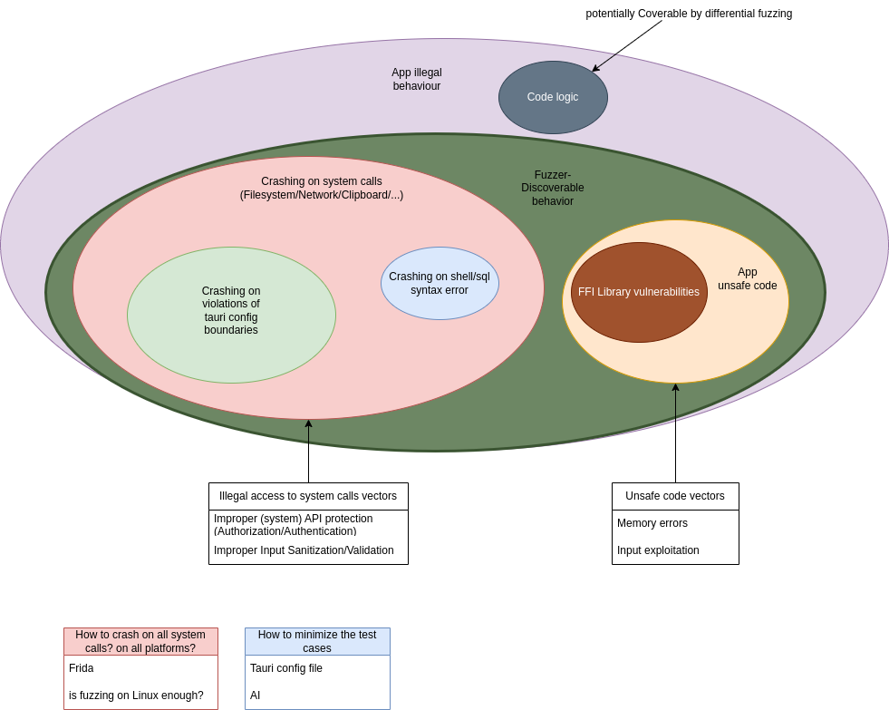

# Principles

## Fuzzing Tauri applications

Tauri applications can be divided into two parts that we will call the backend and the webview.
The backend containing Tauri runtime and the application rust code.

### Attacker model selected

We are fuzzing from the position of an attacker who is able to manipulate the frontend.
His goal is to illegally access any resource that may be on the system which could be command shell,
file system, SQL database, sockets...

Therefore our fuzzer will call Tauri applications entrypoints directly.

## Potential threats

